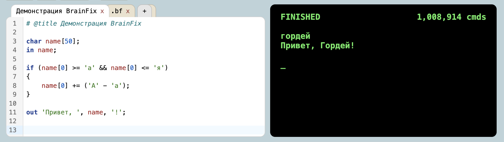
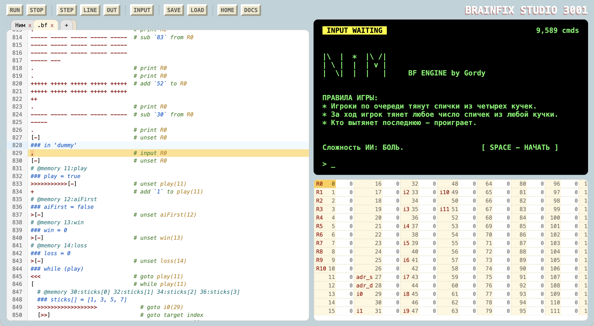

## BrainFix — C-синтаксис без головной боли для Brainfuck

BrainFix — это высокоуровневый Си-подобный язык программирования и компилятор. Он превращает ваш привычный код в чистый и оптимизированный Brainfuck.

**Главные фишки проекта**
* **Си-синтаксис:** Забудьте про хаос из `><+-`. Используйте привычные переменные, многомерные массивы, циклы (`for`, `while`, `do-while`) и условия (`if-else`).
* **Удобная работа с данными:** Нативная поддержка строк и упрощенный ввод/вывод чисел.
* **Экстремальная оптимизация:** Умный компилятор анализирует ваш код и генерирует максимально короткие и быстрые цепочки команд для Brainfuck.
* **Защита вашего разума:** Название говорит само за себя. Проект создан для того, чтобы писать сложные программы на Brainfuck и сохранять рассудок.

Документация:  
https://gordey1999.github.io/brainfix/

## Экосистема и Веб-IDE (BrainFix Studio)

Вместе с языком доступна полноценная среда разработки прямо в браузере.
Вам не нужно ничего устанавливать — писать, компилировать, тестировать и запускать код можно в удобном редакторе.

**Возможности IDE:**
*  **Два редактора в одном:** Пишите код на `BrainFix (.bfx)` или сразу на чистом `Brainfuck (.bf)`.
*  **Встроенный интерпретатор Brainfuck:** Запускайте готовые `.bf` программы любой сложности и взаимодействуйте с ними через удобный терминал.
*  **Встроенный компилятор BrainFix:** Превращайте `.bfx` код в инструкции `.bf` одним нажатием.
*  **Отладка:** Следите за каждым шагом программы и значениями в ячейках памяти для быстрого поиска и исправления багов.

## Примеры проектов, созданных на BrainFix

Чтобы продемонстрировать возможности языка и компилятора, автором написано несколько полноценных проектов.
Вы можете запустить и протестировать их прямо сейчас:

* **Игра «Сапер»** — классическая головоломка с генерацией поля и открытием ячеек.
  
* **Игра «Ним»** — математическая игра против искусственного интеллекта.
  

Эти и другие программы можно запустить в один клик в BrainFix Studio.
Вы также можете использовать эти проекты как шаблоны для изучения синтаксиса BrainFix.