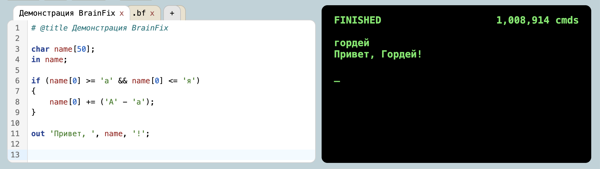
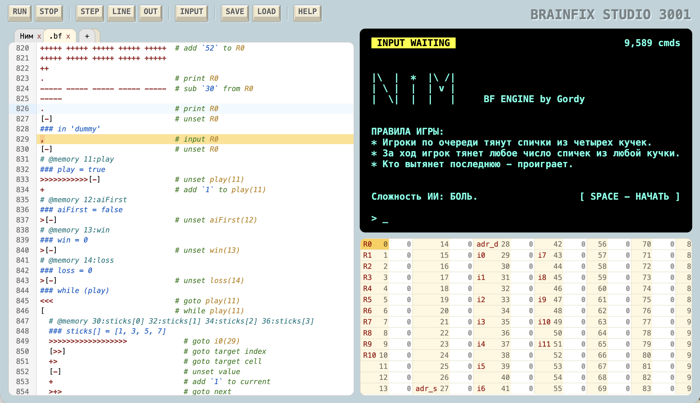
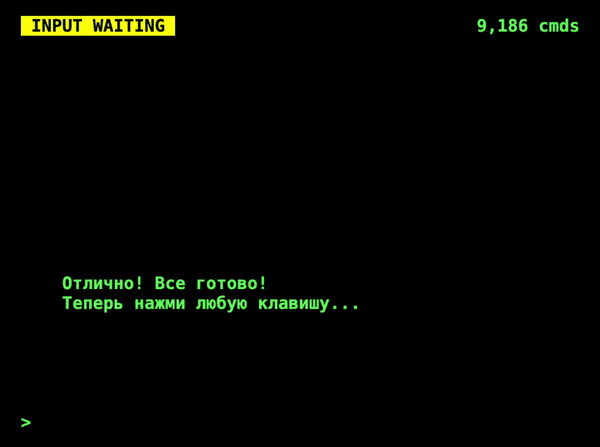
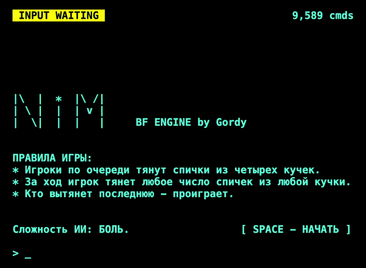
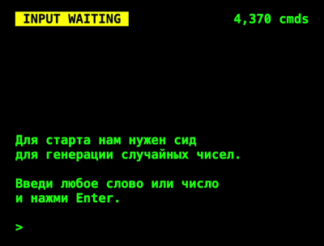

[English](README.md) | **Русский**

# Brainfix

**Brainfix** — это Си-подобный строго типизированный язык программирования высокого уровня, разработанный специально для компиляции в ультракомпактный и оптимизированный код **Brainfuck**. 

Проект призван решить главную проблему эзотерического программирования — экстремально высокую сложность написания, чтения и отладки алгоритмов на чистом Brainfuck. Язык предоставляет разработчику привычные абстракции (переменные, многомерные массивы, циклы и условия), скрывая под капотом всю рутинную и сложную работу.

**Главные фишки Brainfix**
* **Си-синтаксис:** Забудьте про хаос из `><+-`. Используйте привычные переменные, многомерные массивы, циклы (`for`, `while`, `do-while`) и условия (`if-else`).
* **Удобная работа с данными:** Нативная поддержка строк и упрощенный ввод/вывод чисел.
* **Экстремальная оптимизация:** Умный компилятор анализирует ваш код и генерирует максимально короткие и быстрые цепочки команд для Brainfuck.
* **Защита вашего разума:** Название говорит само за себя. Проект создан для того, чтобы писать сложные программы на Brainfuck и сохранять рассудок.

## Экосистема и Веб-IDE (Brainfix Studio)

Вместе с языком доступна полноценная среда разработки прямо в браузере.
Вам не нужно ничего устанавливать — писать, компилировать, тестировать и запускать код можно в удобном редакторе.

**Возможности IDE:**
*  **Два редактора в одном:** Пишите код на `Brainfix (.bfx)` или сразу на чистом `Brainfuck (.bf)`.
*  **Встроенный компилятор:** Превращайте `.bfx` код в инструкции `.bf` одним нажатием.
*  **Встроенный интерпретатор:** Запускайте готовые `.bf` программы любой сложности и взаимодействуйте с ними через удобный терминал.
*  **Визуальная отладка:** Следите за каждым шагом программы и значениями в ячейках памяти для быстрого поиска и исправления ошибок.

## Проекты, созданные на Brainfix

Чтобы продемонстрировать возможности языка и компилятора, на Brainfix было написано несколько полноценных интерактивных проектов:

* **Игра «Сапер»** — классическая головоломка с тремя уровнями сложности, генерацией поля, флагами и открытием ячеек.
* **Игра «Ним»** — математическая игра против продвинутого искусственного интеллекта, победить который крайне сложно.
* **Игра «Виселица»** — интерактивная текстовая игра со встроенной базой на 512 слов, в которой пользователь угадывает скрытое слово по буквам.

<table border="0" cellpadding="0" cellspacing="0" width="100%">
  <tr>
    <td width="50%" align="center">
      
    </td>
    <td width="50%" align="center">
      
    </td>
  </tr>
    <tr>
        <td width="50%" align="center">
          
        </td>
        <td width="50%" align="center"></td>
      </tr>
</table>

Эти и другие программы уже встроены в меню примеров внутри **Brainfix Studio**. Вы можете открыть их в один клик и использовать как готовые шаблоны для изучения синтаксиса языка.
